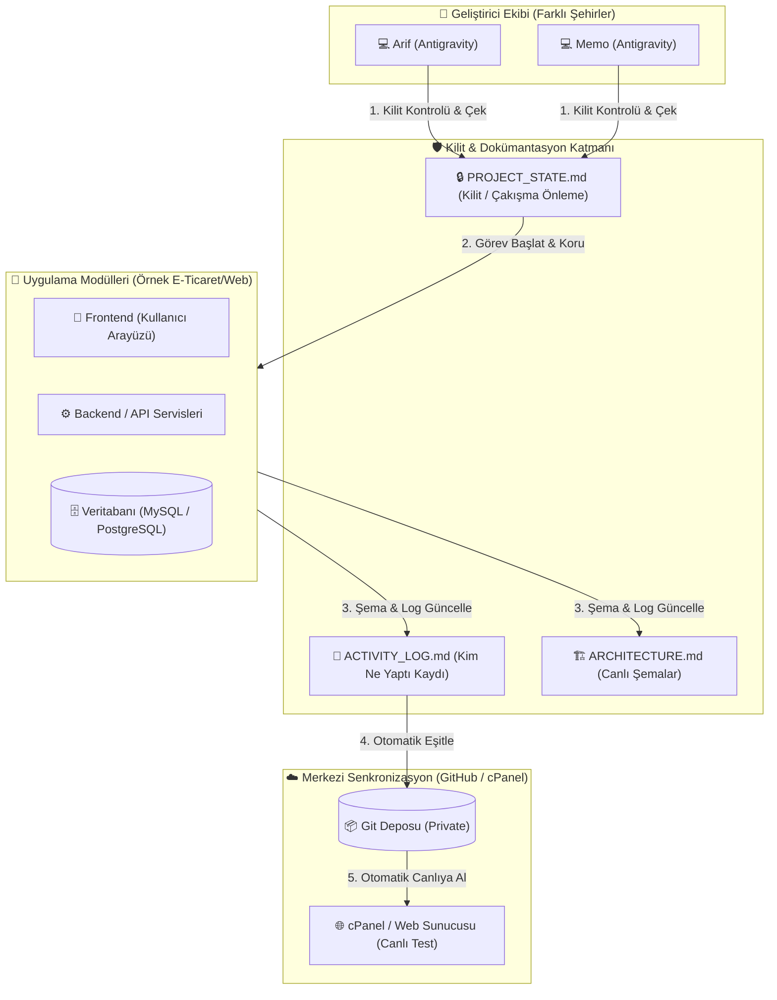
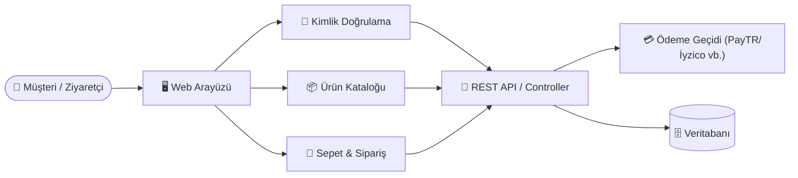

# 🏗️ SİSTEM MİMARİSİ VE CANLI ŞEMA (ARCHITECTURE)

> **Antigravity Kuralı:** Projeye yeni bir sayfa, API, veritabanı tablosu veya modül eklendiğinde aşağıdaki Mermaid şemalarını **güncelle**. Böylece yeni sohbette yapay zeka projeyi tek bakışta tam olarak kavrar.

---

## 1. Genel Sistem & Çalışma Akış Şeması

---

## 2. Modül ve Veri Akış Şeması

---

## 3. Bileşen Haritası (Component Map)

| Modül Adı | Açıklama | Ana Dosya / Dizin | Bağımlılıklar |
| :--- | :--- | :--- | :--- |
| **Ortak Altyapı** | Kilit, Log, Şema ve Kurallar | `/`, `.gemini/rules/` | Antigravity AI |
| **Arayüz (Frontend)** | Tasarım ve Sayfalar | `src/` (veya `public/`) | Backend API |
| **Backend & API** | Sunucu tarafı işlemler, Veritabanı | `api/` (veya `server/`) | cPanel MySQL |

---
*(Proje geliştikçe yeni modüller ve tablolar yukarıdaki şemaya eklenecektir)*
